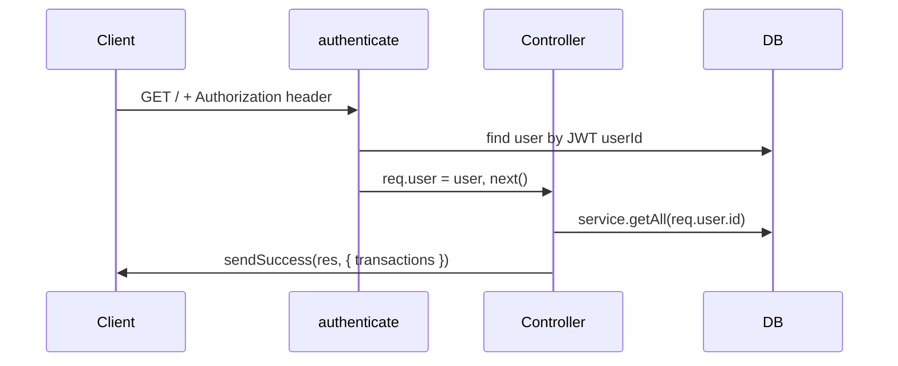

# Backend TS — Express + Prisma + TypeScript

Clean architecture backend with full TypeScript support.

## Stack

| Tool | Purpose |
|---|---|
| **Express** | HTTP server and routing |
| **Prisma** | ORM — auto-generates TS types from your schema |
| **TypeScript** | Type safety across all layers |
| **Zod** | Input validation + inferred types |
| **JWT + bcrypt** | Authentication |
| **ESLint** | Code quality + architecture rules |
| **Jest + Supertest** | Integration testing |

---

## Project structure

```
src/
├── types/
│   ├── express.d.ts    ← extends req.user type globally
│   └── index.ts        ← shared types (AuthUser, JwtPayload...)
├── config/
│   ├── app.ts          ← all env vars in one place
│   └── database.ts     ← single Prisma instance
├── routes/             ← URL + middleware chain only
├── controllers/        ← req/res handling, calls services
├── services/           ← business logic (no req/res)
├── repositories/       ← all Prisma queries (no logic)
├── middlewares/
│   ├── auth.ts         ← JWT verify + role check
│   ├── validate.ts     ← Zod validation factory
│   └── errorHandler.ts ← global error catcher
└── validators/         ← Zod schemas + inferred types
prisma/
├── schema.prisma       ← database models
└── seed.ts             ← dev data
tests/
└── auth.test.ts
```

---

## Quick start

```bash
# 1. Install
npm install

# 2. Configure environment
cp .env.example .env
# Edit .env — set DATABASE_URL and JWT_SECRET

# 3. Generate Prisma client (creates TS types from schema)
npm run db:generate

# 4. Run migrations
npm run db:migrate

# 5. Seed with sample data (optional)
npm run db:seed

# 6. Start dev server
npm run dev
```

---

## The TypeScript advantages in this project

**Prisma auto-generates types from your schema.**
When you run `npm run db:generate`, Prisma reads `schema.prisma` and creates TypeScript types for every model. You never write these manually.

```typescript
// This is automatically typed — no annotation needed:
const user = await prisma.user.findUnique({ where: { id } })
// user.emal  ← TypeScript error (typo caught before runtime)
// user.email ← works, autocompletes in your editor
```

**`req.user` is typed everywhere.**
`src/types/express.d.ts` extends Express globally so every controller knows the exact shape of `req.user` without casting.

**Zod schemas double as TypeScript types.**
```typescript
const createPostSchema = z.object({ title: z.string(), ... })
type CreatePostInput = z.infer<typeof createPostSchema> // free!
```

---

## Request (`req`) and response (`res`)

Every Express controller handler receives `(req, res, next)`. They represent the two sides of one HTTP round-trip.

| | `req` | `res` |
|---|---|---|
| Direction | Client → server | Server → client |
| Role | Read what the client sent | Write what the client receives |
| Typical use | Headers, body, URL params, authenticated user | Status code, JSON body |

### `req` — incoming request

`req` holds everything the client sent:

- **Headers** — e.g. `Authorization: Bearer <token>` via `req.headers.authorization`
- **Body** — JSON on `POST`/`PUT` → `req.body`
- **URL params** — e.g. `/posts/:id` → `req.params.id`
- **Query string** — e.g. `?page=2` → `req.query.page`

Example from a controller:

```typescript
const transactions = await transactionService.getAll(req.user!.id)
```

### `res` — outgoing response

`res` is how you send data back. Use helpers in `src/utils/response.ts` so every endpoint returns the same shape:

```typescript
sendSuccess(res, { transactions })
// → { success: true, data: { transactions } }
```

### Why is there a `user` on `req`?

Express does **not** include `req.user` by default. This project adds it in two steps:

1. **Auth middleware** — Protected routes run `authenticate` before the controller. It verifies the JWT, loads the user from the database, and attaches them to the request:

```typescript
// src/middlewares/auth.ts
req.user = user
next()
```

2. **TypeScript extension** — `src/types/express.d.ts` tells TypeScript that `req.user` exists and what shape it has:

```typescript
interface Request {
  user?: {
    id: string
    email: string
    name: string
    role: Role
  }
}
```

In controllers behind `authenticate`, use `req.user!.id` (the `!` asserts it is defined — safe only because the middleware ran first).

### Request flow for a protected endpoint

Example: `GET /api/transactions` with a Bearer token.



Route wiring (middleware runs left to right):

```typescript
// src/routes/transactionRoutes.ts
router.get('/', authenticate, transactionController.getAll)
```

1. Client sends the request with a JWT in the `Authorization` header.
2. `authenticate` validates the token and sets `req.user`.
3. The controller reads `req.user.id` to scope data to the logged-in user.
4. The controller sends the result with `res` via `sendSuccess`.

**Convention:** Middleware enriches `req`; the controller reads from `req` and writes to `res`; services never touch `req` or `res` (they receive plain values like `userId` instead).

---

## API endpoints

### Auth
| Method | Endpoint | Auth | Description |
|---|---|---|---|
| POST | /api/auth/register | No | Create account |
| POST | /api/auth/login | No | Login, get token |
| GET | /api/auth/me | Yes | Get current user |

### Posts
| Method | Endpoint | Auth | Description |
|---|---|---|---|
| GET | /api/posts | Optional | Published posts (all if admin) |
| GET | /api/posts/:id | No | Single post |
| POST | /api/posts | Yes | Create post |
| PATCH | /api/posts/:id | Yes | Update (author or admin) |
| DELETE | /api/posts/:id | Yes | Delete (author or admin) |

### Comments (nested under posts)
| Method | Endpoint | Auth | Description |
|---|---|---|---|
| GET | /api/posts/:postId/comments | No | Get comments for a post |
| POST | /api/posts/:postId/comments | Yes | Add a comment |
| DELETE | /api/posts/:postId/comments/:id | Yes | Delete (author or admin) |

---

## Adding a new resource — checklist

1. Add model to `prisma/schema.prisma`
2. `npm run db:migrate` — creates the table
3. `npm run db:generate` — updates TS types
4. `src/validators/thingValidators.ts` — Zod schema + inferred types
5. `src/repositories/thingRepository.ts` — Prisma queries only
6. `src/services/thingService.ts` — business logic
7. `src/controllers/thingController.ts` — HTTP handling
8. `src/routes/thingRoutes.ts` — URL mapping
9. Register in `src/app.ts`

## Architecture rules

1. **Routes** → URL + middleware chain only, no logic
2. **Controllers** → translate HTTP ↔ service calls only
3. **Services** → business logic, never import `req`/`res`
4. **Repositories** → database queries only, never import service
5. **Never** call Prisma outside a repository
6. **Always** throw `AppError` for expected errors
7. **Never** return the password field from any query
